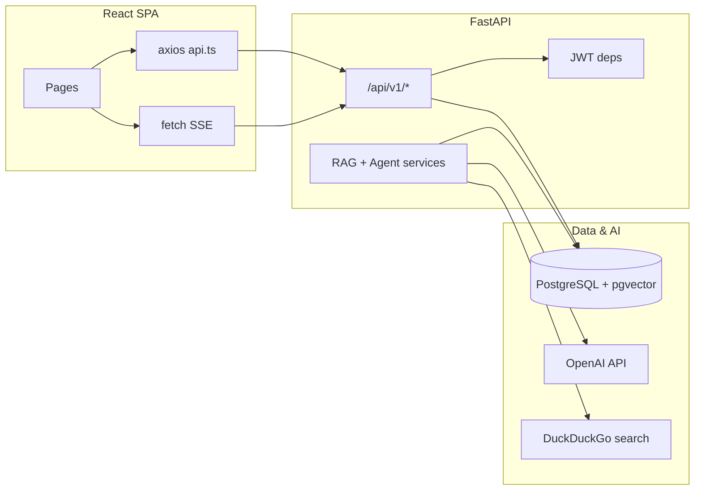

# DocuMind — Backend Architecture & Frontend Connectivity (Interview Guide)

Single reference for explaining **how the system works**, **which file does what**, and **how the React UI talks to the FastAPI backend**. Stack: **FastAPI + SQLAlchemy (async) + PostgreSQL + pgvector**, **LangChain + OpenAI** for embeddings/LLM, **React + Vite + MUI + Zustand**.

---

## 1. Big-picture architecture



**Responsibilities**

- **Frontend**: login, JWT in `localStorage`, REST via Axios, **Server-Sent Events (SSE)** for streaming chat/agent responses.
- **Backend**: JWT auth, CRUD for users/documents/chat sessions, **document ingestion** (chunk + embed + store vectors), **RAG chat** (retrieve similar chunks → LLM), **agent** (keyword-triggered web search + optional doc RAG → LLM).
- **Database**: users, documents, `document_chunks` with **768-dim vectors**, chat sessions/messages.

---

## 2. Environment & URLs

| Piece | Typical value / note |
|--------|----------------------|
| API base (browser) | `VITE_API_URL` or default `http://localhost:8000` → all REST under `{BASE}/api/v1` |
| Axios instance | `frontend/src/services/api.ts` — `baseURL: \`${BASE}/api/v1\`` |
| Vite dev server | Port **3000**; `vite.config.ts` proxies `/api` to `http://backend:8000` (Docker hostname — locally you often set `VITE_API_URL=http://localhost:8000`) |
| Backend | FastAPI, OpenAPI at `/docs`, health at `/health` |
| Static uploads | Backend mounts `/uploads` from `UPLOAD_DIR` |

**Security note for interviews**: API keys and `SECRET_KEY` must live in **`.env`**, not in source control. Treat any hardcoded key in a repo as a defect to fix before production.

---

## 3. Backend — folder layout

```
backend/app/
  main.py                 # App factory, CORS, static /uploads, startup hook
  core/
    config.py             # Pydantic Settings (env)
    security.py           # bcrypt + JWT create/decode
    deps.py               # get_current_user, role guards
  db/
    session.py            # Async engine, AsyncSessionLocal, get_db, Base
    seed.py               # Optional: create tables + seed demo users
  models/                 # SQLAlchemy ORM
  schemas/                # Pydantic request/response models
  api/v1/
    __init__.py           # api_router prefix /api/v1, includes all endpoint modules
    endpoints/            # Route handlers
  services/
    rag_service.py        # Ingestion, embeddings, vector search, RAG stream
    agent_service.py      # Tool-style web/doc context + agent stream
```

---

## 4. Backend — file by file, function by function

### `backend/app/main.py`

| Symbol | What it does |
|--------|----------------|
| `app` | FastAPI instance; title DocuMind; `/docs`, `/redoc`. |
| CORS middleware | Allows `FRONTEND_URL`, localhost 3000/5173; credentials + all methods/headers. |
| `app.mount("/uploads", ...)` | Serves uploaded files from `UPLOAD_DIR`. |
| `app.include_router(api_router)` | Mounts all versioned API routes under `/api/v1`. |
| `resume_incomplete_documents` (startup) | Finds documents in `pending` or `processing`; spawns `asyncio.create_task(rag_service.process_document(id))` so crashes/restarts resume work. |
| `GET /health` | Returns `{"status":"ok","app": ...}` for probes. |

### `backend/app/core/config.py`

| Symbol | What it does |
|--------|----------------|
| `Settings` (Pydantic `BaseSettings`) | Loads DB URL, JWT expiry, OpenAI models, upload limits, `FRONTEND_URL`, etc. from environment (`.env`). |
| `allowed_extensions_list` | Property: splits `ALLOWED_EXTENSIONS` CSV into a list. |
| `settings` | Singleton used across the app. |

### `backend/app/core/security.py`

| Function | Purpose |
|----------|---------|
| `hash_password` | `bcrypt.hashpw` on UTF-8 password. |
| `verify_password` | `bcrypt.checkpw` for login. |
| `create_access_token` | JWT with `sub` (user id), `exp`, `type: "access"`. |
| `create_refresh_token` | JWT with longer expiry, `type: "refresh"`. |
| `decode_token` | Validates JWT with `SECRET_KEY`; returns payload dict or `None`. |

### `backend/app/core/deps.py`

| Symbol | Purpose |
|--------|---------|
| `bearer` | `HTTPBearer()` — expects `Authorization: Bearer <token>`. |
| `get_current_user` | Decodes access token, requires `type == "access"`, loads `User` by id, checks `is_active`. |
| `require_role(*roles)` | Factory returning a dependency that returns 403 if `current_user.role` not in `roles`. |
| `require_admin` | Admin only. |
| `require_manager` | Admin or Manager. |

### `backend/app/db/session.py`

| Symbol | Purpose |
|--------|---------|
| `db_url` | Rewrites `postgresql://` → `postgresql+asyncpg://` for async driver. |
| `engine` | `create_async_engine` with pool options. |
| `AsyncSessionLocal` | Session factory; `expire_on_commit=False` for safer reads after commit. |
| `Base` | SQLAlchemy `DeclarativeBase` for all models. |
| `get_db` | FastAPI dependency: yields session, **commits** on success, **rollbacks** on exception, closes session. |

### `backend/app/models/user.py`

| Symbol | Fields / behavior |
|--------|-------------------|
| `UserRole` enum | `admin`, `manager`, `user`. |
| `User` | `id`, `name`, `email` (unique), `hashed_password`, `role`, `avatar_url`, `is_active`, timestamps. |
| Relationships | `documents`, `chat_sessions` with cascade delete. |

### `backend/app/models/document.py`

| Symbol | Purpose |
|--------|---------|
| `DocumentStatus` | `pending` → `processing` → `ready` or `failed`. |
| `Document` | Metadata: title, filename, `file_path`, type, size, `status`, optional `summary`, `total_chunks`, `owner_id`. |
| Relationships | `owner`, `chunks`, `chat_sessions`. |

### `backend/app/models/chunk.py`

| `DocumentChunk` | `document_id`, `content`, `chunk_index`, **`embedding` (`Vector(768)`)** via pgvector, timestamps. Comment in code mentions Gemini dim; runtime uses OpenAI embeddings at 768 dims in `rag_service`. |

### `backend/app/models/chat.py`

| Symbol | Purpose |
|--------|---------|
| `MessageRole` | `user`, `assistant`, `system`. |
| `ChatSession` | `title`, `user_id`, optional `document_id`, `session_type` (`rag` \| `agent`). |
| `ChatMessage` | `session_id`, `role`, `content`, optional `sources` (JSON string for RAG citations). |

### `backend/app/schemas/auth.py`

Pydantic models for API I/O: `UserCreate`, `UserUpdate`, `UserResponse`, `LoginRequest`, `TokenResponse`, `RefreshRequest`. `UserResponse` uses `from_attributes = True` to build from ORM rows.

### `backend/app/schemas/documents.py`

| Schema | Use |
|--------|-----|
| `DocumentResponse` | Document list/detail JSON shape. |
| `ChatSessionCreate` / `ChatSessionResponse` | Create/list chat sessions. |
| `ChatMessageResponse` | Message history. |
| `ChatRequest` | `session_id` + `message` for RAG stream. |
| `AgentRequest` | `query` + optional `session_id`. |
| `SourceChunk` | Typed shape for source snippets (also serialized as JSON in `sources`). |

### `backend/app/api/v1/__init__.py`

| Symbol | Purpose |
|--------|---------|
| `api_router` | `APIRouter(prefix="/api/v1")`. |
| `include_router` | Mounts: `auth`, `users`, `documents`, `chat`, `agent` (each adds its own sub-prefix). |

### `backend/app/api/v1/endpoints/auth.py` — prefix `/auth`

| Route | Handler logic |
|-------|----------------|
| `POST /auth/login` | Find user by email, verify password, check active; return access + refresh JWTs + `UserResponse`. |
| `POST /auth/register` | Reject duplicate email; create user with `hash_password`; return tokens + user. |
| `POST /auth/refresh` | Validate refresh token type; re-issue access + refresh. |
| `GET /auth/me` | `get_current_user` → `UserResponse`. |

### `backend/app/api/v1/endpoints/users.py` — prefix `/users` (admin for mutating/list/stats)

| Route | Logic |
|-------|--------|
| `GET /users/` | List all users, newest first — **`require_admin`**. |
| `POST /users/` | Create user — admin; duplicate email check. |
| `PATCH /users/{id}` | Partial update via `UserUpdate` — admin. |
| `DELETE /users/{id}` | Delete user; cannot delete self — admin. |
| `GET /users/stats/overview` | Counts users, documents, chat sessions — admin. |

### `backend/app/api/v1/endpoints/documents.py` — prefix `/documents`

| Route | Logic |
|-------|--------|
| `GET /documents/` | Marks stale `processing` docs (no chunks, older than 15 minutes) as `failed`. **Admin** sees all documents; others see `owner_id == current_user.id`. |
| `POST /documents/upload` | Validates extension; streams file to disk with size cap; creates `Document` `PENDING`; **`background_tasks.add_task(rag_service.process_document, doc.id)`**. |
| `GET /documents/{id}` | Owner or admin only. |
| `DELETE /documents/{id}` | Deletes file on disk and DB row; owner or admin. |

### `backend/app/api/v1/endpoints/chat.py` — prefix `/chat`

| Route | Logic |
|-------|--------|
| `POST /chat/sessions` | Optional `document_id`: validates doc exists; sets title `Chat: {doc.title}`; stores `session_type` from payload (default `rag`). |
| `GET /chat/sessions` | Current user’s sessions, newest first. |
| `GET /chat/sessions/{id}/messages` | Ensures session belongs to user; ordered messages. |
| `POST /chat/stream` | Validates session + ownership; saves **user** `ChatMessage`; returns **`StreamingResponse`** (SSE). Generator calls `rag_service.stream_rag_response`; yields JSON lines `type: token` / `sources` / `done`; then saves **assistant** message with `sources`. |
| `DELETE /chat/sessions/{id}` | User-owned session delete. |

### `backend/app/api/v1/endpoints/agent.py` — prefix `/agent`

| Route | Logic |
|-------|--------|
| `POST /agent/stream` | Resolves or creates `ChatSession` (`session_type` agent); saves user message; streams **`agent_service.stream_agent_response`**. First yields `session_id` for client continuity; streams tokens; on success persists assistant message. SSE headers disable buffering where possible. |

### `backend/app/services/rag_service.py` — class `RAGService`, singleton `rag_service`

| Method | Behavior |
|--------|----------|
| `__init__` | If `OPENAI_API_KEY` set: `OpenAIEmbeddings` (768 dims) + `ChatOpenAI`; else disabled. `RecursiveCharacterTextSplitter` chunk_size 1000, overlap 200. |
| `_extract_text` | PDF via `pypdf`, DOCX via `python-docx`, txt/md as UTF-8 text. |
| `process_document` | **Phase 1**: load doc, set `PROCESSING`. **Phase 2**: extract + split text (no long-held DB connection). **Phase 3**: embed each chunk, insert `DocumentChunk` rows, set doc `READY` + `total_chunks`. On failure or missing API key → `FAILED`. Uses **`AsyncSessionLocal()`** own sessions so work is not tied to the HTTP request’s DB scope. |
| `retrieve_chunks` | Embeds query; raw SQL **cosine distance** `<=>` on pgvector, returns top-k chunks with similarity score `1 - distance`. |
| `stream_rag_response` | Requires doc `READY`; retrieves chunks; builds system prompt with context only; emits `__SOURCES__...__SOURCES_END__` then **async streams** LLM tokens via `llm.astream`. |

### `backend/app/services/agent_service.py` — class `AgentService`, singleton `agent_service`

| Method | Behavior |
|--------|----------|
| `_search_web` | `DuckDuckGoSearchRun` from LangChain community. |
| `_list_documents` | Lists user’s `READY` documents as text for the LLM. |
| `_query_document` | Delegates to `rag_service.retrieve_chunks` for a single doc. |
| `stream_agent_response` | Heuristic keywords: **web** (`search`, `latest`, …), **docs** (`document`, `list`, …). Gathers context strings (web results, doc list, optional multi-doc snippets). If neither, does a general web “research” pass. Then streams markdown-friendly answer from `ChatOpenAI.astream`. |

### `backend/app/db/seed.py`

| Function | Purpose |
|----------|---------|
| `create_tables` | `CREATE EXTENSION vector`; `Base.metadata.create_all`. |
| `seed_users` | Inserts default admin/manager/user if admin email absent (demo passwords hashed). |
| `main` | `asyncio.run` orchestration. |

### `backend/alembic/env.py`

Wires Alembic to `settings.DATABASE_URL` and `Base.metadata` (imports models for registration). Used for **migrations**; `seed.py` is an alternative bootstrap for quick dev.

### `backend/app/__init__.py`

Package marker (empty or minimal).

---

## 5. API quick reference (what the UI calls)

| Method | Path | Auth | Role |
|--------|------|------|------|
| POST | `/api/v1/auth/login` | No | — |
| POST | `/api/v1/auth/register` | No | — |
| POST | `/api/v1/auth/refresh` | No (body refresh token) | — |
| GET | `/api/v1/auth/me` | Bearer | any |
| GET/POST/PATCH/DELETE | `/api/v1/users/...` | Bearer | admin (as implemented) |
| GET | `/api/v1/users/stats/overview` | Bearer | admin |
| GET | `/api/v1/documents/` | Bearer | any (scoped) |
| POST | `/api/v1/documents/upload` | Bearer | multipart `file` |
| GET/DELETE | `/api/v1/documents/{id}` | Bearer | owner/admin |
| POST | `/api/v1/chat/sessions` | Bearer | — |
| GET | `/api/v1/chat/sessions` | Bearer | — |
| GET | `/api/v1/chat/sessions/{id}/messages` | Bearer | — |
| POST | `/api/v1/chat/stream` | Bearer | SSE body `{session_id, message}` |
| DELETE | `/api/v1/chat/sessions/{id}` | Bearer | — |
| POST | `/api/v1/agent/stream` | Bearer | SSE body `{query, session_id?}` |

---

## 6. Streaming protocol (SSE) — what both sides expect

Backend sends **lines** like: `data: {"type":"token","data":"..."}\n\n`

| `type` | Meaning |
|--------|---------|
| `token` | Partial assistant text (RAG or agent). |
| `sources` | (RAG only) JSON string of chunk snippets + scores — UI can parse for citations. |
| `session_id` | (Agent) server-assigned session id for follow-up turns. |
| `done` | Stream finished; UI typically appends final assistant message to local state. |

**RAG** (`chat.py`): user message is committed **before** stream starts; assistant row written **after** stream completes.

**Why `fetch` + `ReadableStream` on the frontend?** Axios does not handle SSE as cleanly as `EventSource`, and you need **POST with JSON body + Authorization header**, so the app uses **`fetch`** with `Authorization: Bearer` and parses `data: ` lines manually (`ChatPage`, `AgentPage`).

---

## 7. Frontend — how it connects (file by file)

### `frontend/src/services/api.ts`

| Piece | Purpose |
|-------|---------|
| `BASE` | `import.meta.env.VITE_API_URL \|\| 'http://localhost:8000'`. |
| `api` | Axios instance with `baseURL: BASE + '/api/v1'`. |
| Request interceptor | Attaches `Authorization: Bearer ${localStorage.access_token}`. |
| Response interceptor | On **401**, tries `POST /auth/refresh` with `refresh_token`; updates tokens and retries once; on failure clears storage and redirects to `/login`. |
| `authApi` | `login`, `register`, `me`. |
| `usersApi` | `list`, `create`, `update`, `delete`, `stats`. |
| `documentsApi` | `list` (dedupes in-flight + 2s cooldown cache), `upload` (multipart), `get`, `delete`. |
| `chatApi` | Sessions CRUD + `getMessages` (no stream — stream uses `fetch`). |
| `BASE_URL` | Exported for raw `fetch` to `/chat/stream` and `/agent/stream`. |

### `frontend/src/store/authStore.ts`

Zustand + `persist`: stores `user`, tokens, `isAuthenticated`. `setAuth` writes tokens to **localStorage** (duplicated with persist for axios). `logout` clears tokens. **Partialized persist** only stores `user` + `isAuthenticated` (tokens still in localStorage keys used by axios).

### `frontend/src/components/auth/ProtectedRoute.tsx`

If not authenticated → `/login`. If `allowedRoles` set and user’s role not allowed → `/dashboard`. Otherwise renders `<Outlet />`.

### `frontend/src/App.tsx`

React Router: `/login` public; nested routes under `ProtectedRoute` → `AppLayout` → pages. **`/users`** uses a **nested** `ProtectedRoute allowedRoles={['admin']}` wrapping `UsersPage`. Unknown routes → `/dashboard`.

### `frontend/src/components/layout/AppLayout.tsx` + `Sidebar.tsx`

Shell: sidebar + `<Outlet />` for page content. Sidebar filters nav by `user.role`; logout clears auth and navigates to login.

### `frontend/src/pages/LoginPage.tsx`

`authApi.login` → `setAuth` → navigate `/dashboard`. Demo chips fill credentials for seeded users.

### `frontend/src/pages/DashboardPage.tsx`

`documentsApi.list()` for all users; if `user.role === 'admin'`, also `usersApi.stats()` for aggregate counts. Renders document stats and quick links. *(Non-admin fourth stat tile uses `stats` that is only loaded for admin, so that tile may show “—” for non-admin — implementation detail.)*

### `frontend/src/pages/DocumentsPage.tsx`

Lists documents; **react-dropzone** upload → `documentsApi.upload(FormData)`; refresh list; delete via API; **Chat** button creates RAG session via `chatApi.createSession({ document_id, session_type: 'rag' })` and navigates to `/chat?session={id}`.

### `frontend/src/pages/ChatPage.tsx`

Loads `chatApi.listSessions()` (filters `session_type === 'rag'`), `documentsApi.list()` (ready docs). `selectSession` loads `chatApi.getMessages`. **Send**: optimistic user bubble; **`fetch(BASE_URL + '/api/v1/chat/stream', POST, Bearer, JSON)`**; reads stream; on `sources`/`token`/`done` updates UI; `MessageBubble` parses `sources` JSON for chunk citations.

### `frontend/src/pages/AgentPage.tsx`

Maintains local `sessionId`. **`fetch('/api/v1/agent/stream')`** with `{ query, session_id }`; handles `session_id` event first; accumulates `token` events; on `done` pushes assistant message. “Clear conversation” resets UI state (server session id cleared — next message creates a new session server-side).

### `frontend/src/pages/UsersPage.tsx`

Admin CRUD: `usersApi.list/create/update/delete`. Create sends `form` including password (matches `UserCreate`).

### `frontend/src/components/chat/MessageBubble.tsx`

User: plain text. Assistant: **ReactMarkdown + remark-gfm**. Optional `sources`: JSON → `SourceChunk[]` → expandable citation chips.

### `frontend/src/types/index.ts`

TypeScript mirrors backend shapes: `User`, `Document`, `ChatSession`, `ChatMessage`, `AdminStats`, `SourceChunk`, etc.

### `frontend/vite.config.ts`

Dev server port 3000; proxy `/api` → backend (Docker service name `backend`). For local backend without Docker, prefer **`VITE_API_URL=http://localhost:8000`** so the browser hits the correct host.

### `frontend/src/main.tsx`

React root mount (standard Vite entry).

---

## 8. End-to-end flows (interview sound bites)

**Login → authenticated request**

1. User posts credentials to `/api/v1/auth/login`.
2. Backend returns JWTs; frontend stores tokens + user.
3. Every Axios request gets `Authorization: Bearer <access>`.
4. On 401, refresh flow runs once; failure → logout redirect.

**Upload → RAG-ready**

1. `POST /documents/upload` saves file, inserts row `pending`, schedules `process_document`.
2. Worker extracts text, splits chunks, embeds with OpenAI, stores vectors in pgvector, sets `ready` + chunk count.
3. UI polls/refreshes list (or manual Refresh) to see status.

**Chat (document Q&A)**

1. UI creates session with `document_id` (RAG type).
2. User sends message → `POST /chat/stream`.
3. Backend saves user message, retrieves similar chunks, streams LLM answer, saves assistant message with `sources`.

**Agent**

1. UI streams to `/agent/stream` with optional `session_id`.
2. Backend may create new `ChatSession` (`session_type` agent), run web/doc heuristics, stream final answer.

---

## 9. Likely interview questions & short answers

**Q: Why FastAPI?**  
Async-first, automatic OpenAPI, native support for `Depends`, Pydantic validation, and `StreamingResponse` for SSE.

**Q: Why pgvector?**  
Store embeddings next to relational data; use SQL `<=>` operator for similarity without a separate vector DB (trade-off: ops simplicity vs. massive scale).

**Q: How is auth implemented?**  
JWT access + refresh; bcrypt password hashing; `HTTPBearer` dependency resolves current user per request.

**Q: How do you scope multi-tenant data?**  
Documents filtered by `owner_id` unless admin; chat sessions filtered by `user_id`; agent/RAG retrieval uses `document_id` or `owner_id` as coded.

**Q: Why separate RAG vs Agent?**  
RAG is **strictly grounded** on one attached document. Agent adds **web search** and **multi-document** heuristics for broader questions.

**Q: Frontend-backend contract for streaming?**  
POST + JSON + Bearer; response body is SSE-style `data: {JSON}\n\n`; types `token`, `sources`, `session_id`, `done`.

**Q: What happens on server restart during ingestion?**  
`startup` event re-queues `process_document` for any doc still `pending`/`processing`.

**Q: Redis in settings?**  
Configured in `Settings` but **not shown in core request path** in the code walkthrough above — candidate extension: rate limiting, task queue, or caching.

---

## 10. Demo users (from seed)

If you run `seed.py`, typical seeded accounts use emails like `admin@documind.ai`, `manager@documind.ai`, `user@documind.ai` with documented passwords in `seed.py` (change in production).

---

*This document reflects the DocuMind codebase layout and behavior as of the snapshot used to generate it. Use `/docs` on a running server to confirm exact request/response schemas during live demos.*
