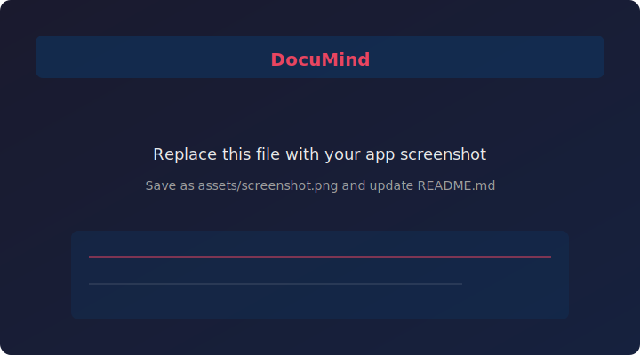

<div align="center">

# DocuMind

**AI-powered document intelligence** — RAG over your files, a research agent with web search, and role-based access.

[](https://www.python.org/)
[](https://fastapi.tiangolo.com/)
[](https://react.dev/)
[](LICENSE)

[Features](#-features) · [Quick start](#-quick-start) · [Configuration](#-configuration) · [Architecture](#-architecture)

<br/>



*Add a real screenshot: save it as `assets/screenshot.png` and update the image `src` above.*

</div>

---

## Features

- **Auth** — JWT with roles: Admin, Manager, User  
- **Documents** — Upload PDF, DOCX, TXT, MD; chunked and embedded into **pgvector**  
- **RAG chat** — Ask questions with **streaming** responses (SSE)  
- **AI agent** — Web search (DuckDuckGo) + document tools  
- **Admin** — User and document management, usage-oriented views  
- **Workspaces** — Multi-tenant style organization for teams  

## Tech stack

| Layer | Technology |
|--------|------------|
| Frontend | React 18, TypeScript, Vite, Material UI, Zustand |
| Backend | Python 3.11, FastAPI, SQLAlchemy (async) |
| Database | PostgreSQL 16 + **pgvector** |
| AI | **OpenAI** (chat + embeddings) via **LangChain** |
| Cache | Redis |
| Deploy | Docker Compose |

## Quick start

### Prerequisites

- [Docker](https://docs.docker.com/get-docker/) & Docker Compose  
- [OpenAI API key](https://platform.openai.com/api-keys) (for embeddings and LLM)  

### 1. Clone and configure

```bash
git clone https://github.com/YOUR_USERNAME/documind.git
cd documind
cp .env.example .env
```

Replace `YOUR_USERNAME` with your GitHub username after you publish (see below). Edit `.env`: set `SECRET_KEY` and `OPENAI_API_KEY` (see [Configuration](#-configuration)).

### 2. Run

```bash
docker compose up --build
```

On first start the API runs migrations and seeds default users.

### 3. Open the app

| Service | URL |
|--------|-----|
| Web app | [http://localhost:3000](http://localhost:3000) |
| API | [http://localhost:8000](http://localhost:8000) |
| OpenAPI docs | [http://localhost:8000/docs](http://localhost:8000/docs) |

### Default users (seeded)

| Email | Password | Role |
|-------|----------|------|
| admin@documind.ai | Admin@123 | Admin |
| manager@documind.ai | Manager@123 | Manager |
| user@documind.ai | User@123 | User |

Change these passwords before any public deployment.

## Configuration

| Variable | Purpose |
|----------|---------|
| `SECRET_KEY` | JWT signing — use a long random string |
| `DATABASE_URL` | Async Postgres URL (see `.env.example`) |
| `OPENAI_API_KEY` | Required for RAG and agent features |
| `OPENAI_MODEL` | Chat model (default `gpt-4o-mini`) |
| `OPENAI_EMBEDDING_MODEL` | Embedding model (default `text-embedding-3-small`) |
| `FRONTEND_URL` | CORS origin for the SPA |

The frontend calls the API at `VITE_API_URL` (default `http://localhost:8000` in Docker). For custom setups, set it when building the frontend.

**Security:** Never commit `.env` or real API keys. This repository’s `.gitignore` excludes them. If a key was ever committed or shared, **rotate it** in the OpenAI dashboard.

## Project layout

```text
documind/
├── backend/          # FastAPI app, Alembic, services (RAG, agent)
├── frontend/         # React + Vite SPA
├── docker-compose.yml
├── .env.example      # Template — copy to .env
├── DOCUMIND_INTERVIEW_GUIDE.md   # Architecture & API notes (interviews / onboarding)
└── LICENSE
```

## Architecture

For sequence diagrams, endpoint map, and how the UI talks to the API, see **[DOCUMIND_INTERVIEW_GUIDE.md](DOCUMIND_INTERVIEW_GUIDE.md)**.

## License

This project is released under the [MIT License](LICENSE).

## Contributing

Issues and pull requests are welcome. Please keep secrets out of the repo and use `.env` locally.

## Publishing to GitHub

If this folder is not a Git repository yet:

```bash
cd documind
git init
git add .
git commit -m "Initial commit: DocuMind"
```

Create a new empty repository on GitHub (no README license, or delete the default files), then:

```bash
git remote add origin https://github.com/YOUR_USERNAME/documind.git
git branch -M main
git push -u origin main
```

Update the clone URL and badges in this README to match your repo.

---

<div align="center">
Built for document Q&A and research workflows.
</div>
